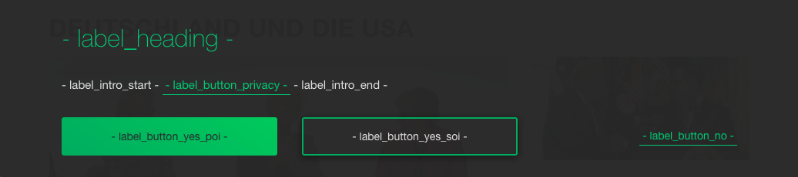

== How to implement OIL on your site

** Setting up OIL on your pages is really easy.
All you need to do is include the main Javascript file and an additional configuration snippet.
OIL uses JS events to communicate with its host site.

** The POI functionality is currently still in beta and should not be used without permission from the business owner.

=== Basic Setup

Below you'll find a simple example that shows you how to listen to OIL's opt-later event. To run OIL in your page you need to include 3 scripts.

#1. Put OIL's configuration object somewhere in the upper part of your page. Please leave the developer mode false to begin with, see the parameter section below for more details.
[source,json]
----
  
----

#2. Register an event handler with a callback to be executed when OIL fires the opt-later event.
[source,javascript]
----
  
----

#3. Add the main Oil.js file somewhere in the lower part of your page.
[source, javascript]
----

----
* Updated versions of the script will be deployed using a different filename hence we'll never alter an existing version.
* Don't be fooled by the "demos" part in the URL, it's for real.

#4. That's it! Load your page to see OIL in action.

=== OIL Configuration

You need to add the configuration snippet to all pages where OIL is required. This is an example configuration:

[source,json]
----
    
----

.Configuration Parameters
[width="100%",options="header", cols="1,3,1,1"]
|====
|Config Parameter | Description | Default Setting|POI optional feature
| opt_in_event_name | The name for the Javascript event that will be sent to the host when a users selects opt in. | 'oil_optin_done'|No
| opt_later_event_name | The name for the Javascript event name that will be sent to the host when a user selects (clicks, taps) opt later. | 'oil_optlater_trigger'|No
| opt_out_event_name | The Javascript event name OIL is listening to for opting out. Please note: The opt-out functionality has to be implemented manually by the site owner on the host site! | 'oil_optout_trigger'|No
| has_opted_in_event_name | This event will be fired on each page load, but only if the user has opted in previously. | 'has_opted_in_event_name'| No
| has_opted_later_event_name | This event will be fired on each page load, but only if the user has opted later previously. | 'has_opted_later_event_name'| No
| developer_mode | The developer mode is useful when testing OIL in a production or live environment, it wil show more information for debugging. A boolean value to toggle a developer mode. For security reasons the overlay **will not show per default** when the developer mode is enabled. Create a cookie named "oil_developer" with the value "true". This will show the OIL layer on your client. | true|No
| privacy_page_url | OIL should always have a link to your privacy page ("Datenschutz"). If you add the key "privacy_page_url", the show more label ("Mehr erfahren") can't be changed and will be added to OIL. It opens a page with the value you specified in a new tab or window. You can either use a relative or absolute URL.| "" (empty string)|No
| activate_poi | Activates or disactivates Power Opt In. Rememeber that you also have to setup the hub.js part if you do so, or you will endup with a non-working button. | false|Yes
| hub_origin | The origin of the hub.js installation, if any. | none|Yes
| hub_path | The path to the hub.html installation on the origin, if any. | none|Yes
| subscriber_set_cookie | Whether to set the SOI cookie on POI opt-ins or not. | true|Yes
| ga_tracking | A nummeric value to enable/disable Google Anayltics event tracking.
* 0=disabled
* 1=enabled for YES clicks
* 2=enabled for all clicks including NO 

The core Google Analytics script has to be available on the site, OIL is not injecting a GA script onto the site. See the separate chapter below for furhter details. 
*Important!* Please note that GA tracking should of course only be enabled for testing purposes. | 0 | No 
|====

.Label Keys
[width="100%",options="header", cols="1,3"]
|====
|Config Parameter|Default value
|label_heading| Um euch die besten Inhalte präsentieren zu können, brauchen wir euer Einverständnis
|label_intro_start| Wir verwenden Cookies, um unser Angebot zu verbessern und euch maßgeschneiderte Inhalte zu präsentieren. Es ist dafür erforderlich, bei eurem Besuch dem Datenschutz entsprechend bestimmte Informationen zu erheben und ggf. auch an Partner zu übertragen.
|label_intro_end| Jetzt Einverständnis erklären:
|label_later_start| Wir verwenden Cookies, um unser Angebot zu verbessern und euch maßgeschneiderte Inhalte zu präsentieren. Es ist dafür erforderlich, bei eurem Besuch dem Datenschutz entsprechend bestimmte Informationen zu erheben und ggf. auch an Partner zu übertragen. In unseren Datenschutzbestimmungen erfahren Sie, wie Sie Cookies deaktivieren können
|label_later_end| Jetzt Einverständnis erklären:
|label_button_yes_soi| Jetzt zustimmen
|label_button_yes_poi| Global zustimmen
|label_button_no| Nein, jetzt nicht
|label_button_privacy| Mehr erfahren  
|====

Initial state: Configuration keys for labels used initially

---

image::images/oil-labels-later.png[]
Later state: Configuration keys for labels when the user has clicked "no" in the initial state

---

=== Google Analytics Dashboard for OIL Events

Please import this dashboard into your Google Analytics account to see all events which are tracked in the Event Category "OIL",
* https://analytics.google.com/analytics/web/template?uid=XRNeLppXRiy-u1h2deSNcg
* OIL Event Dashboard by ideaxels@gmail.com

image::images/GA-OIL-Dashboard.png[]

=== Tealium Configuration

The Tealium integration of Oil.js has not yet been completed for company-wide use in production.
We keep you up to date and will update the instructions here accordingly.